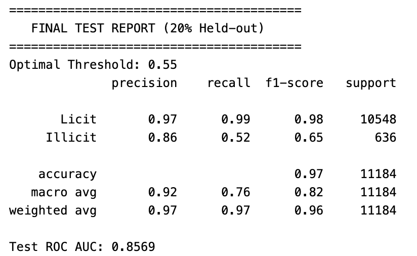

# 🕵️‍♂️ Illicit Transaction Detection on Bitcoin Network using Temporal GNNs


This project focuses on detecting illicit transactions (money laundering, fraud) on the Bitcoin network using the **Elliptic Data Set**.

The core innovation of this repository is the application of **Temporal Graph Neural Networks (TGAT/CT-GNN)** combined with a rigorous **Incremental Learning Strategy** to handle the dynamic nature of cryptocurrency flows and **Concept Drift** over time.

## 🚀 Key Features

* **Temporal Modeling:** Implements **TGAT** (Temporal Graph Attention Network) and **CT-GNN** to capture dynamic graph structures and temporal edge interactions.
* **Incremental Learning:** A K-Fold training strategy where each subsequent fold initializes weights from the previous fold's best model. This allows the model to "remember" past patterns while adapting to new ones (mitigating Catastrophic Forgetting).
* **Robust Ensemble Inference:** Aggregates predictions from multiple temporal snapshots (folds) to produce stable predictions on the future **Held-out Test Set (20%)**.
* **Threshold Calibration:** Addresses the confidence shift in future data by calibrating the decision threshold based on Validation data, prioritizing **Recall** to minimize missed illicit transactions.
* **Explainability:** Integrated **GNNExplainer** to visualize and interpret why specific transactions are flagged as illicit.
* **Comprehensive Baselines:** Includes comparisons with Logistic Regression, GCN, and GraphSAGE.

## 📂 Repository Structure

| File | Description |
| :--- | :--- |
| **`ct-gnn-kfold.ipynb`** | 🏆 **Main Pipeline (Best Model)**. Implements CT-GNN (Robust TGAT) with **Incremental K-Fold Training**. Features temporal sorting, ensemble inference, and final evaluation using AUC & Average Precision (AP). |
| **`ct-gnn.ipynb`** | Development notebook for Continuous-Time GNN architecture and Time Encoders. |
| **`tgat.ipynb`** | Implementation of the standard **TGAT** architecture. |
| **`tgnmodel.ipynb`** | Implementation of **TGN (Temporal Graph Network)** with memory modules for node state persistence. |
| **`graphsage.ipynb`** | Baseline model using **GraphSAGE** (Inductive Learning). |
| **`LR_GCN.ipynb`** | Standard baselines: **Logistic Regression** and Static **GCN**. |
| **`tgatexplainability.ipynb`** | 🔍 **Explainability Module**. Uses **GNNExplainer** to highlight important subgraphs and features driving the fraud detection logic. |

## 📊 Dataset & Preprocessing

The project uses the **Elliptic Data Set**:
* **Nodes:** 203,769 transactions.
* **Edges:** 234,355 payment flows.
* **Timesteps:** 49 discrete steps (spanning ~2 weeks).
* **Classes:** `Licit` (0), `Illicit` (1), `Unknown`.

**Preprocessing Strategy:**
1.  **Temporal Sorting:** Data is strictly sorted by `timestep` and `txId` to prevent look-ahead bias.
2.  **80/20 Split:**
    * **Train/Validation:** Timesteps 1 to 39 (First 80%).
    * **Held-out Test:** Timesteps 40 to 49 (Last 20% - Future Data).
3.  **Scaling:** Standard Scaler fitted *only* on the training set to avoid data leakage.

## 🧠 Methodology: Incremental Learning

To tackle **Concept Drift** (criminals changing behavior over time), we use an incremental approach:

1.  **Fold 1 (Start):** Train from scratch on initial timesteps.
2.  **Fold 2...N:** Load the best model weights from `Fold N-1`, lower the learning rate (fine-tuning), and continue training on new data.
3.  **Ensemble:** The final prediction on the Test Set is the average probability output of all 5 incremental models.

## 📈 Performance & Results

The model is evaluated on the **Held-out Test Set (Timesteps 40-49)**, which represents unseen future data.

* **ROC AUC:** **~0.85 - 0.86** (Demonstrating strong ranking capability).
* **Metric Stability:** Instead of F1-score (which is threshold-sensitive and volatile), we use **Average Precision (AP)** and **AUC** to visualize performance stability over time.

### Threshold Calibration
Standard thresholds (0.5) often fail on future data due to confidence shifts. We apply **Manual Threshold Calibration** (e.g., lowering to ~0.25 - 0.35) derived from validation analysis to significantly boost **Recall**, ensuring fewer illicit transactions slip through.



## 🛠️ Installation

1.  Clone the repository:
    ```bash
    git clone https://github.com/BCSecRes/fraudGNN.git
    ```

2.  Install dependencies:
    ```bash
    pip install torch torch-geometric pandas numpy scikit-learn matplotlib seaborn
    ```

3.  Download the dataset from [Kaggle](https://www.kaggle.com/ellipticco/elliptic-data-set) and place the CSV files in the input directory.


---
